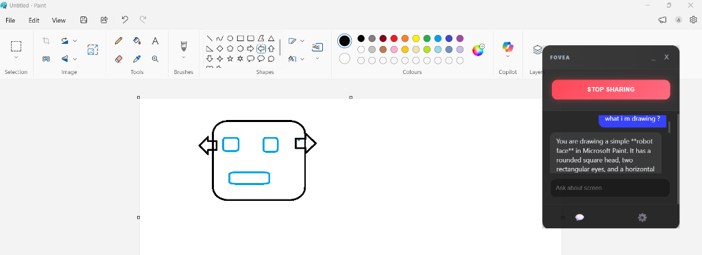

# Fovea SDK

**Foveated Streaming Engine** for High-Performance Screen Sharing.


## Overview
Fovea uses **WebAssembly (Rust)** to perform "Foveated Rendering" on video streams entirely on the client side. It detects changes in the screen and only sends high-resolution updates for the active region (ROI), while blurring the static background. This results in **massive bandwidth savings (up to 90%)** for screen sharing applications.

## Installation

```bash
npm install fovea-sdk
```

(Note: During private beta, install from local path or private registry)

## Usage

### 1. Electron (Node.js)

```javascript
const FoveaEngine = require('fovea-sdk');
const path = require('path');

async function start() {
    const engine = new FoveaEngine({ blurAmount: '12px' });
    
    // Initialize with local WASM file
    await engine.initialize({ 
        wasmPath: path.join(__dirname, 'node_modules/fovea-sdk/fovea_rs/pkg/fovea_wasm_bg.wasm') 
    });

    function loop() {
        // Process video frame -> canvas
        const result = engine.process(videoElement, outputCanvas);
        
        if (result && result.type === 'foveated') {
             console.log(`ROI: ${JSON.stringify(result.bbox)}`);
        }
        requestAnimationFrame(loop);
    }
}
```

### 2. Browser (React/Vue/Vanilla)

Copy the `.wasm` file to your public assets folder first.

```javascript
import FoveaEngine from 'fovea-sdk';

const engine = new FoveaEngine();

// Initialize by fetching WASM from public URL
await engine.initialize({ 
    wasmPath: '/assets/fovea_wasm_bg.wasm' 
});

// ... use engine.process() in your render loop
```

## 🚀 Quick Start & Examples
We provide a complete **Vanilla JS** example to get you running in seconds. It demonstrates:
*   **Side-by-Side Comparison** (Raw vs. Foveated)
*   **Real-time Bandwidth Stats**
*   **AI Integration Hooks**

### Run the Demo
1.  **Clone the Repo**
    ```bash
    git clone https://github.com/agentifyanchor/fovea-sdk.git
    cd fovea-sdk
    ```

2.  **Run the Example**
    ```bash
    cd examples/vanilla-js
    npm start
    ```
    *(This starts a local web server at `http://localhost:3000`)*

3.  **Explore the Code**
    *   `examples/vanilla-js/main.js`: Shows how to wrap the WASM engine and access the raw pixel data.

## Real-World Example
Using **Fovea** with an AI Video Analyzer to detect and describe drawings in real-time with minimal bandwidth usage:



## API

### `new FoveaEngine(config)`
- `config.blurAmount`: CSS blur string (default `'8px'`)
- `config.diffThreshold`: Sensitivity (0-255) for change detection (default `30`)

### `async initialize(options)`
- `options.wasmPath`: Path (Node) or URL (Browser) to the `.wasm` binary.
- `options.wasmBuffer`: ArrayBuffer of the WASM binary (optional alternative).

### `process(video, canvas)`
- `video`: Source HTMLVideoElement
- `canvas`: Target HTMLCanvasElement (where the foveated effect is drawn)
- Returns: `{ type, bbox, isKeyframe }`

## License
MIT
